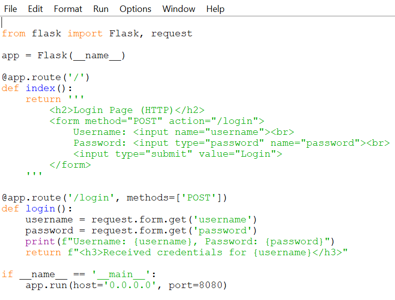
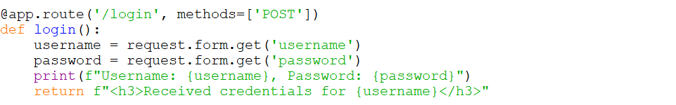
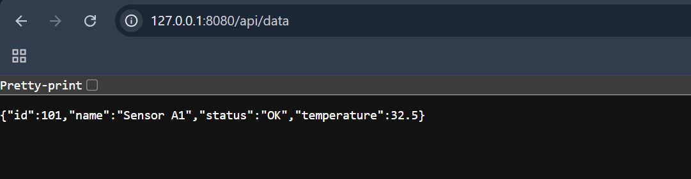
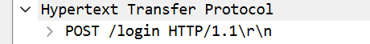
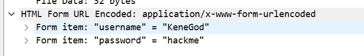
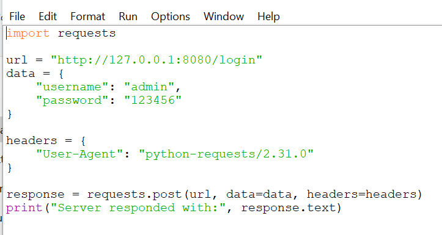
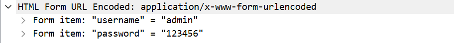

# # HTTP Traffic Analysis using Wireshark & Python

This project demonstrates how attackers can exploit insecure HTTP traffic to intercept sensitive data using tools like **Wireshark**. Since modern websites use HTTPS, this exercise simulates a vulnerable HTTP environment to study network traffic patterns, form submissions, and common security issues.

## Overview

- Created a **local HTTP server** using Python and Flask to simulate a basic login page.
- Used **Wireshark** to capture and analyze HTTP traffic from browser submissions and scripted attacks.
- Simulated a **public API endpoint** to observe how attackers can target exposed services.
- Developed a **Python login script** to mimic automated client behavior (commonly used in recon and brute force attacks).
- Identified security vulnerabilities such as:
- Credentials transmitted in clear text
- Unauthenticated API access
- Script-based requests (e.g., using `python-requests` User-Agent)

## Objectives

- Understand how HTTP traffic looks on the wire.
- Demonstrate the risks of transmitting sensitive data over HTTP.
- Practice packet analysis from a SOC analyst perspective.
- Simulate potential attacker behavior in a controlled environment.

## Tools & Technologies

- **Python 3**
- **Flask** (for simulating HTTP web services)
- **Wireshark** (for packet capture and analysis)
- **Browser** (to simulate user interactions)
- **Python Requests library** (for automation simulation)

##  Project Structure
http-traffic-analysis/ 
├── app.py                 # Flask web server with login & API endpoint 
├── login_script.py        # Python script to send automated login POST request 
├── requirements.txt       # Flask & requests dependencies 
├── README.md              # Project documentation
├── screenshots/           # Screenshots used in the README
     ├── 
     ├── 
     ├── 
     ├── 
     ├── 
     ├── 
     ├── 
     
     
## How It Works

### 1. Start Local Server

Launch the Flask app:
''' bash
python app.py
This starts a local HTTP server at http://127.0.0.1:8080 serving:

a. /: Login form 

b. /login: POST handler for credentials 

c. /api/data: A mock API returning JSON data 

### 2. Wireshark Traffic Capture

Open Wireshark

Select the Loopback or Wi-Fi interface (depending on setup)

Start capture

Apply filter: http

### 3. Submit Login Form

Open browser

Navigate to: http://127.0.0.1:8080

Enter dummy credentials (i entered KeneGod, hackme)

Observe POST request and Form Data in Wireshark

### 4. Test the API Endpoint

Visit http://127.0.0.1:8080/api/data in your browser

Observe the JSON response in cleartext

Capture and analyze the HTTP response packet in Wireshark

### 5. Simulate Automated Attack

Run the provided script:

python login_script.py

This sends a POST login using the Python requests module, allowing you to inspect:

User-Agent string (e.g., python-requests/2.x)

Suspicious client behavior (non-browser)

Form payloads from automation tools

🕵 Security Issues Identified

Issue	Description

🔓 Clear Text Credentials	Username and password visible in HTTP POST
🛑 Lack of TLS (HTTPS)	All data transmitted unencrypted
❌ No API Authentication	/api/data accessible without login
🤖 Scripted Access	Python scripts can bypass UI protections

