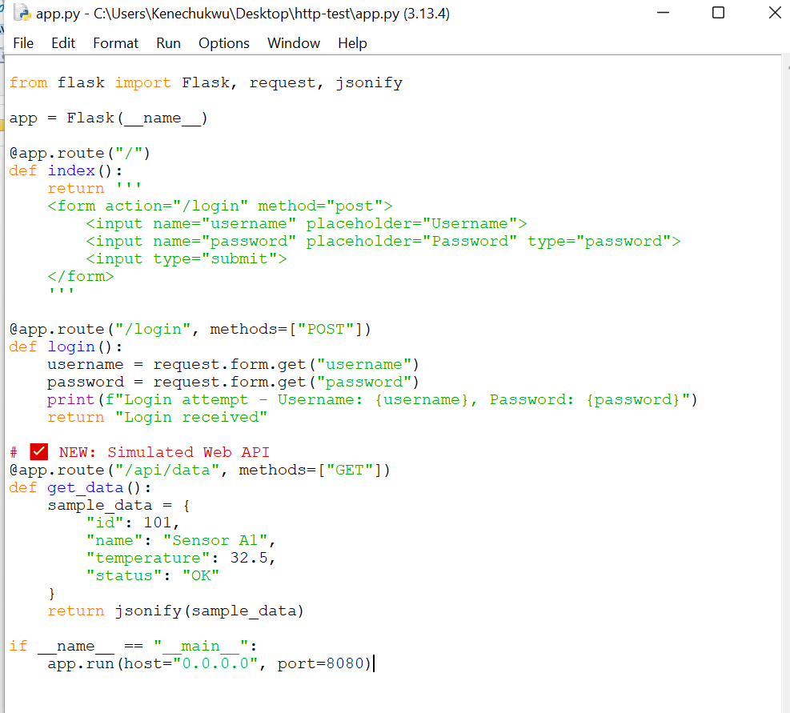
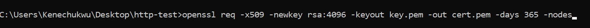
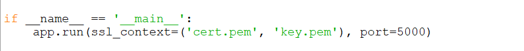
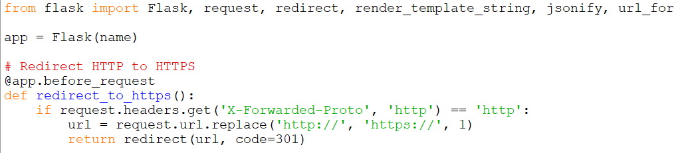
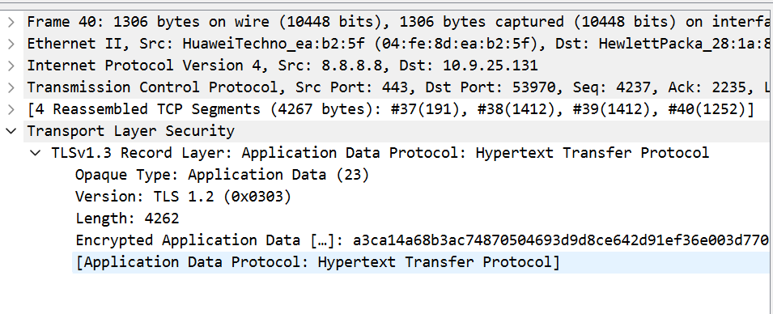
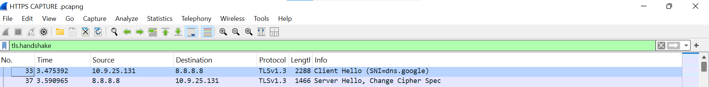
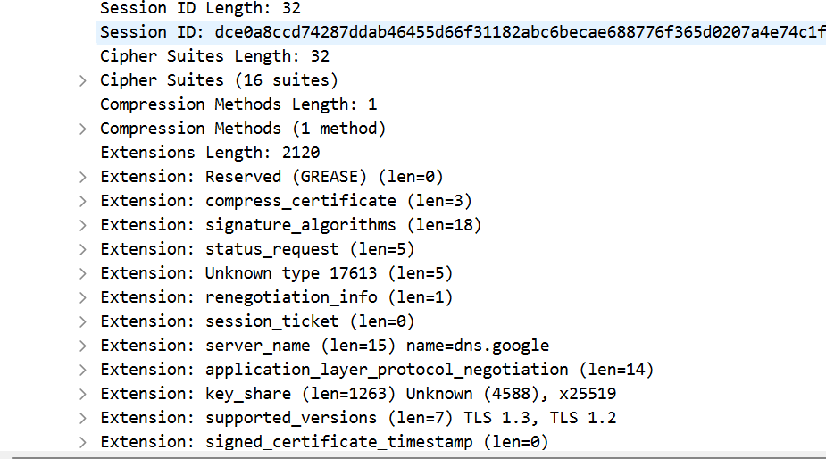

# # HTTP Traffic Analysis using Wireshark & Python

This project demonstrates how attackers can exploit insecure HTTP traffic to intercept sensitive data using tools like **Wireshark**. Since modern websites use HTTPS, this exercise simulates a vulnerable HTTP environment to study network traffic patterns, form submissions, and common security issues.

## Overview

- Created a **local HTTP server** using Python and Flask to simulate a basic login page.
- Used **Wireshark** to capture and analyze HTTP traffic from browser submissions and scripted attacks.
- Simulated a **public API endpoint** to observe how attackers can target exposed services.
- Developed a **Python login script** to mimic automated client behavior (commonly used in recon and brute force attacks).
- Identified security vulnerabilities such as:
- Credentials transmitted in clear text
- Unauthenticated API access
- Script-based requests (e.g., using `python-requests` User-Agent)

## Objectives

- Understand how HTTP traffic looks on the wire.
- Demonstrate the risks of transmitting sensitive data over HTTP.
- Practice packet analysis from a SOC analyst perspective.
- Simulate potential attacker behavior in a controlled environment.

## Tools & Technologies

- **Python 3**
- **Flask** (for simulating HTTP web services)
- **Wireshark** (for packet capture and analysis)
- **Browser** (to simulate user interactions)
- **Python Requests library** (for automation simulation)

##  Project Structure
http-traffic-analysis/ 
├── app.py                 # Flask web server with login & API endpoint 
├── login_script.py        # Python script to send automated login POST request 
├── requirements.txt       # Flask & requests dependencies 
├── README.md              # Project documentation
├── screenshots/           # Screenshots used in the README
     
     
## How It Works

### 1. Start Local Server

Launch the Flask app:
''' bash
python app.py
This starts a local HTTP server at http://127.0.0.1:8080 serving:

a. /: Login form 

b. /login: POST handler for credentials 

c. /api/data: A mock API returning JSON data 

### 2. Wireshark Traffic Capture

Open Wireshark

Select the Loopback or Wi-Fi interface (depending on setup)

Start capture

Apply filter: http

### 3. Submit Login Form

Open browser

Navigate to: http://127.0.0.1:8080

Enter dummy credentials (i entered KeneGod, hackme)

Observe POST request and Form Data in Wireshark

### 4. Test the API Endpoint

Visit http://127.0.0.1:8080/api/data in your browser

Observe the JSON response in cleartext

Capture and analyze the HTTP response packet in Wireshark

### 5. Simulate Automated Attack

Run the provided script:

python login_script.py

This sends a POST login using the Python requests module, allowing you to inspect:

User-Agent string (e.g., python-requests/2.x)

Suspicious client behavior (non-browser)

Form payloads from automation tools

## Security Issues Identified

Issue    Description

🔓 Clear Text Credentials	Username and password visible in HTTP POST

🛑 Lack of TLS (HTTPS)	All data transmitted unencrypted

❌ No API Authentication	/api/data accessible without login

🤖 Scripted Access	Python scripts can bypass UI protections

## Recommendations ( With Practical Actions)

🔐 Recommendation 1: Implement HTTPS with a Valid TLS Certificate

Issue Identified
During analysis, credentials were transmitted over plain HTTP. This exposes sensitive data (e.g., usernames and passwords) to interception by attackers via packet sniffing tools like Wireshark.

Recommendation
All sensitive data in transit should be protected using HTTPS with a valid TLS/SSL certificate. This ensures that data exchanged between clients and the server is encrypted and protected from interception.

🔧 Practical Actions Taken (With Screenshots 📸)

1. A self-signed TLS certificate and private key were generated using OpenSSL for the simulated Flask environment.

   ✅ Certificate and Key Generation

 

2. The Flask application was configured to serve traffic over HTTPS (port 5000) using the generated certificates.

   ✅ Configured Flask

   

3. A redirect was implemented to force all HTTP requests to HTTPS.
   
✅ Flask HTTP Redirection

4. Wireshark was used to confirm encrypted traffic and the presence of TLS handshake packets.

   ✅ Encrypted Traffic

   

✅ TLS Handshake Packets

✅ TLS Handshake Info

✅ Outcome

Plaintext credentials are no longer visible on Wireshark.

All network traffic is encrypted using TLS.

The project now mimics a secure production environment for analysis and learning.

## Blocking Python Scripts by Filtering User-Agent

Many Python scripts use default agents like:

1. python-request/2.31.0
2. curl/7.79.1

To block python login script, i implemented a basic bot-blocking technique using User-Agent Filtering.

To see if this worked, i captured and decrypted HTTPS traffic using SSLKEYLOGFILE and Wireshark and confirmed the block by seeing 403 Forbidden in Wireshark.

Screenshots

Implementing User-Agent Filtering in the Flask app.py

   

